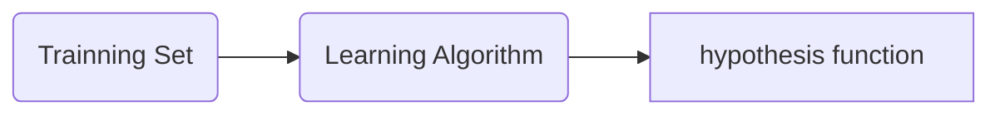
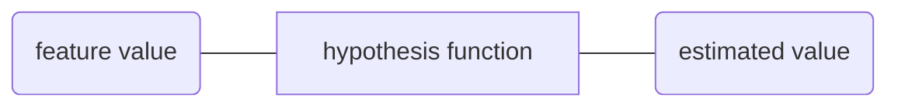

## What is machine learning
Machine learning is a computer program is said to learn from **experience E** with respect to some **task T** and some **performance measure P**. 
if its performance on T, as measured by P. improves with experience E.

计算机从数据中获取到经验E，用于完成任务T.   通过P来对经验E进行考核，汲取更好的经验。

### Supervised Learning Vs Unsupervised Learning 【监督学习和非监督学习】
---
- 监督学习是能向机器提供带有正确答案的数据集，
在监督学习中用到的算法有Classification vs Regression 【分类和回归】
    - Classification, 求解的值是离散值
    
        例子如：对邮件进行处理来标记垃圾邮件、非垃圾邮件。对肿瘤数据进行处理来预测肿瘤是恶性、还是良性。
    - Regression. 求解的值是连续的值

        例子对房价进行预测、对商品的销量运行预测。
-   无监督学习是不能向机器提供有正确答案的数据集。
    - cluster 【聚类算法】： 给机器一堆数据、没有告诉电脑这个是什么、要做什么、期望机器能自动进行识别。
    
    例子：鸡尾酒派对效应

    声音数据样本中有掺杂着不同语言的声音（一个用英语数数、一个用法语数数）。机器可以根据语言的特征将声音数据分成两类。

    声音数据样本中有掺杂着不同类别的声音（背景声为歌曲音乐、有数数的声音）。机器可以根据声音的特征将背景音乐和数数声音提起出来

## 算法

- 回归算法
  - 线性回归
    

